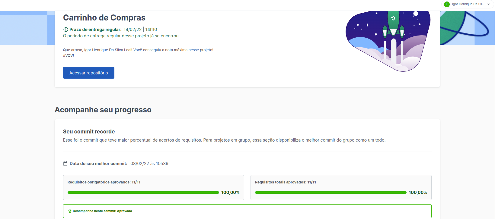

# Shopping cart 

---

## Sobre o projeto

Esse projeto foi desenvolvido por mim ([Igor Leal](www.linkedin.com/in/igorlealh)) utilizando HTML e CSS para posicionamento e estilização dos elementos e JavaScript para a interação do usuário. Os 11 requisitos obrigatórios foram concluídos, otendo assim, 100% de aprovação.
O projeto foi iniciado ao final do Bloco 09 do Módulo de Fundamentos do Desenvolvimento Web da [Trybe](https://www.betrybe.com/).

Foi utilizada a API do [Mercado Livre](https://www.mercadolivre.com.br/) para realizar as requisições e obter os detalhes de cada produto em tela.

A página é um site de comércio de eletrônicos em que o usuário pode adicionar ou remover itens do seu carrinho de compras e visualizar o valor total de sua compra em tempo real.

[Clique aqui](https://igorhleal.github.io/project-shopping-cart/) para acessar a página em seu navegador.

---

## Habilidades desenvolvidas

* Desenvolver página web utilizando HTML, CSS e JavaScript
* Implementar testes unitários com o Jest
* Utilizar funções assíncronas para realizar requisições em uma API

## Ferramentas utilizadas

* HTML
* CSS
* JavaScript
* Jest

---

